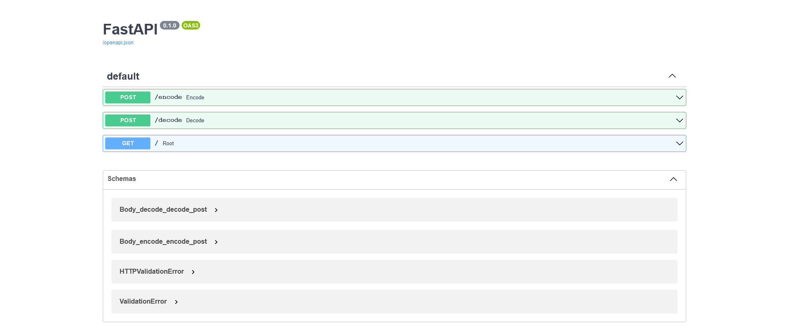

# hidden-api

FastAPI application, meant to be used for encoding and decoding messages in images i.e. steganography.

Implementation of steganography using the least significant bits of the RGB values of an image.

Note: It is encouraged to not use plain text as messages. [Reference for Advanced Encryption Standard](https://en.wikipedia.org/wiki/Advanced_Encryption_Standard).

## Supported formats

### input

- PNG
- JPEG

Note: APNG or other animated image inputs will have unintended transformations in the encoded image.

### output

- PNG

Note: Output image will be in RGB / RGBA color modes only.

## To check out the project...

> Clone / Download zip

> run "pip install -r requirements.txt" (will require python>=3.9.6 and pip>=21.2.4)

> run "uvicorn main:app --reload"

Feedback is appreciated. Thank you!
